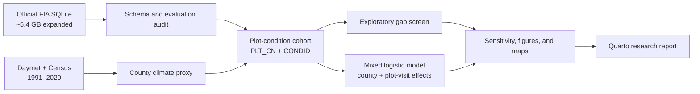

# Canopy to Cohort

[](https://dineshpotla.github.io/canopy-to-cohort/report/)
[](https://github.com/dineshpotla/canopy-to-cohort/actions/workflows/r-unit-tests.yml)
[](LICENSE)

**Detecting exploratory sugar maple regeneration gaps in Michigan northern hardwood forests using FIA, Daymet, GIS, and statistical modeling**

**[Explore the live research report →](https://dineshpotla.github.io/canopy-to-cohort/report/)**

This is one research-style portfolio project built around a clear ecological question:

> Where do contemporary Michigan northern-hardwood FIA observations combine substantial established sugar maple with little evidence of sugar-maple seedlings, and which measured factors are associated with that mismatch?

## 60-second technical tour

| Capability | What is implemented | Evidence |
|---|---|---|
| Large relational data | Schema-aware extraction from Michigan's approximately 5.4 GB expanded FIADB SQLite database | [`R/fia_extract.R`](R/fia_extract.R), [`scripts/01_inspect_fia.R`](scripts/01_inspect_fia.R) |
| Data quality | Key assertions, pre-aggregation before joins, sampling-opportunity logic, provenance hashes, and hand-check samples | [`R/validation.R`](R/validation.R), [`tests/testthat/`](tests/testthat/) |
| Statistical modeling | Supported mixed-effects logistic regression with county and plot-visit random intercepts, diagnostics, and sensitivity analysis | [`R/models.R`](R/models.R), [model results](https://dineshpotla.github.io/canopy-to-cohort/report/#model-associations) |
| Spatial integration | County-safe FIA geography joined to 1991–2020 Daymet climate normals without exposing protected plot locations | [`R/climate.R`](R/climate.R), [spatial results](https://dineshpotla.github.io/canopy-to-cohort/report/#broad-geographic-pattern) |
| Research communication | A manuscript-style Quarto report, decision log, analytical data dictionary, figures, and automated tests | [live report](https://dineshpotla.github.io/canopy-to-cohort/report/), [data dictionary](https://dineshpotla.github.io/canopy-to-cohort/docs/data-dictionary.html) |

## Why this project

The repository demonstrates:

- relational FIA data engineering;
- explicit join and data-integrity audits;
- R and reproducible research workflows;
- spatially responsible use of protected FIA locations;
- interpretable ecological modeling;
- publication-quality figures and research communication.

It is intentionally not a machine-learning leaderboard or dashboard.

**Technical stack:** R, DBI/RSQLite, dplyr, tidyr, ggplot2, lme4,
broom.mixed, DHARMa, Quarto, testthat, and renv.

## Analysis architecture




## Main findings

Release v1.1.0 pins the Michigan 2025 current evaluation (EVALID 262501;
inventory window 2019–2025; assigned measurement records 2018–2025). It yielded
1,457 eligible northern-hardwood plot-condition measurements in 78 counties. Of 1,424
conditions with demonstrated microplot sampling, sugar-maple seedlings were
tallied in 815 (57.2%). The transparent primary screen flagged 119 observations
(8.4%) that combined upper-third sugar-maple basal-area share among sampled
conditions with no seedlings tallied; an upper-quartile sensitivity rule
flagged 93 (6.5%).

The supported mixed-effects logistic model used county and plot-visit random
intercepts and converged without a singularity. Higher established sugar-maple
basal area was associated with lower odds of no seedlings being tallied (OR
0.40, 95% CI 0.33–0.49 per SD of log basal area). County-scale temperature and
precipitation also carried associations, but they are broad spatial proxies and
are not interpreted as causal, plot-level climate effects.


## Data and scientific scope

- **FIA:** Michigan state SQLite database from the USDA Forest Service FIA DataMart.
- **Climate:** 1991–2020 Daymet temperature and precipitation normals at an interior representative location for each county.
- **Geography:** FIA county identifiers, Census Gazetteer internal points, and
  `maps` package county polygons.
- **Unit:** one plot-condition measurement (`PLT_CN + CONDID`).
- **Primary response:** whether sugar-maple seedlings were tallied on sampled microplots.

Public FIA coordinates are protected. This project does not plot them or treat them as exact field positions. County climate is a broad proxy.

## Outputs

After `make all`, the project produces:

1. a study-area sample map;
2. a live-tree composition figure;
3. an established-maple versus regeneration hero figure;
4. an odds-ratio effect plot;
5. a supported broad-area gap map and county uncertainty plot;
6. a Quarto project website and research report under `_site/`;
7. join, missingness, provenance, source-snapshot, and model-support audits.

The [live rendered report](https://dineshpotla.github.io/canopy-to-cohort/report/)
is the primary research artifact; its source is
[report/index.qmd](report/index.qmd).

Curated, non-confidential release evidence is checked into the repository:
[source provenance](outputs/audits/data-provenance.csv),
[selected evaluation](outputs/audits/selected-evaluation.csv),
[join audits](outputs/audits/fia-join-audit.csv),
[model support](outputs/tables/model-support.csv),
[sensitivity results](outputs/tables/gap-threshold-sensitivity.csv), and the
[release validation record](outputs/audits/release-validation.csv).

## Reproduce

### Review without downloading FIA

Use the [live report](https://dineshpotla.github.io/canopy-to-cohort/report/)
and the checked-in aggregate evidence above. GitHub Actions installs the
lightweight test dependencies, runs 11 data-free expectations, and skips five
tests that require derived data or a fitted model. The v1.1.0 full local build
passed all 33 expectations; that scope difference is recorded explicitly in
the release validation file. After `make setup`, the same data-free subset can
be run locally with `make test` before downloading FIA.

The report source reads excluded derived files, so `make report` cannot render
from a fresh clone until the full data pipeline has completed.

### Full rebuild

Requirements: R 4.4 or newer, Quarto, Make, and enough disk space for the
Michigan FIA SQLite archive. Release v1.1.0 was tested with R 4.6.1 and Quarto
1.9.38.

```bash
make setup
make acquire
make all
```

`make setup` restores the package versions recorded in `renv.lock`; subsequent
R commands automatically use the project library through `renv`.

Raw source files are downloaded into `data/raw/` and excluded from Git. The
Michigan SQLite archive is about 1.1 GB compressed and expands to roughly
5.4 GB, so plan for at least 8 GB of free disk space. See
[data/README.md](data/README.md) for sources and expected locations.

The published release is tied to the exact source sizes and SHA-256 checksums in
[`outputs/audits/data-provenance.csv`](outputs/audits/data-provenance.csv) and to
EVALID 262501 in [`config/config.yml`](config/config.yml). FIA's state archive
URL is mutable: `make acquire` fetches the current official archive and warns if
it differs from the v1.0.0/v1.1.0 source snapshot. The evaluation remains pinned, but
upstream corrections can still change a rerun. Byte-for-byte reproduction
therefore requires source files matching the published manifest; otherwise the
commands perform a documented rerun against the current official data.

## Interpretation guardrails

- “No seedlings tallied” is not proof of ecological absence.
- The regeneration-gap indicator is exploratory and sample-relative.
- Associations are not causal effects.
- County maps summarize analyzed observations, not design-based prevalence.
- Formal statewide FIA estimates require evaluation and population-estimation procedures not claimed by this analysis.

## Project structure

```text
R/                 reusable analysis functions
scripts/           ordered pipeline entry points
data/              raw, interim, and processed data
outputs/           figures, tables, models, and audits
tests/testthat/     data and calculation tests
report/             Quarto research report
config/             transparent analysis thresholds and paths
```

The central scientific and implementation decisions are recorded in [docs/analysis-decisions.md](docs/analysis-decisions.md).
The published fields, units, derivations, and interpretation boundaries are documented in [docs/data-dictionary.md](docs/data-dictionary.md).

## Data availability and licensing

The analysis code is released under the [MIT License](LICENSE). Source data are
not redistributed in this repository: FIA, Daymet, and Census artifacts remain
governed by their respective providers. Raw, interim, and record-level processed
files are excluded from Git; the repository publishes code, documentation,
derived aggregate figures, and curated non-confidential validation summaries.

The website is deployed from the pre-rendered `_site/` directory to the
`gh-pages` branch. This keeps the multi-gigabyte FIA database out of GitHub while
preserving a fast, stable portfolio artifact. Maintainers with a completed local
build can update it with `make publish`.

## Citation

Citation metadata are provided in [CITATION.cff](CITATION.cff).

## Sources

- [USDA Forest Service FIA DataMart](https://research.fs.usda.gov/products/dataandtools/fia-datamart)
- [FIADB Database Description and User Guide](https://research.fs.usda.gov/understory/forest-inventory-and-analysis-database-user-guide-nfi)
- [Daymet V4 R1](https://doi.org/10.3334/ORNLDAAC/2129)
- [U.S. Census Gazetteer files](https://www.census.gov/geographies/reference-files/time-series/geo/gazetteer-files.html)
