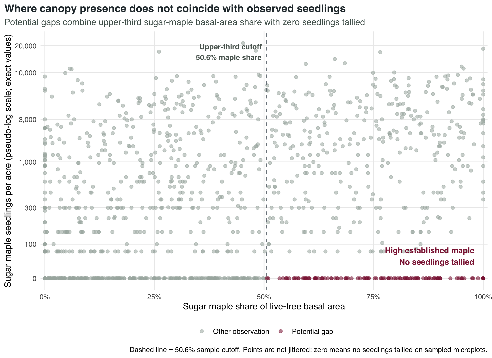

```{r}
#| label: setup
summary <- readr::read_csv(here::here("outputs", "tables", "analysis-summary.csv"), show_col_types = FALSE)
support <- readr::read_csv(here::here("outputs", "tables", "model-support.csv"), show_col_types = FALSE)
odds <- readr::read_csv(here::here("outputs", "tables", "model-odds-ratios.csv"), show_col_types = FALSE)
evaluation <- readr::read_csv(here::here("outputs", "audits", "selected-evaluation.csv"), show_col_types = FALSE)
maple_effect <- odds |>
  dplyr::filter(.data$label == "Sugar maple basal area") |>
  dplyr::slice_head(n = 1)
if (nrow(maple_effect) != 1L) stop("Required sugar maple model effect not found.")
```

:::: {.columns .landing-hero}
::: {.column width="46%"}
## A forest can keep its canopy while losing its next cohort

This project asks where contemporary Michigan FIA observations combine substantial established sugar maple with no sugar-maple seedlings tallied—and which measured stand and broad climate characteristics accompany that mismatch.

[Read the research report](report/index.qmd){.btn .btn-primary .btn-lg}
[Review analysis decisions](docs/analysis-decisions.md){.btn .btn-outline-secondary .btn-lg}
:::

::: {.column width="54%"}
{fig-alt="Scatterplot of sugar maple basal-area share against seedling density, highlighting sampled conditions that meet the exploratory regeneration-gap screen."}
:::
::::

## The study at a glance

::::: {.stat-grid}
:::: {.stat-card}
::: {.stat-number}
`r scales::comma(summary$plot_conditions)`
:::
Eligible plot-condition measurements
::::

:::: {.stat-card}
::: {.stat-number}
`r scales::comma(summary$seedling_sampled)`
:::
Conditions with seedling sampling
::::

:::: {.stat-card}
::: {.stat-number}
`r scales::comma(summary$potential_gaps)`
:::
Exploratory potential gaps
::::

:::: {.stat-card}
::: {.stat-number}
`r summary$counties`
:::
Michigan counties represented
::::
:::::

## What the analysis found

Sugar-maple seedlings were tallied in **`r scales::percent(summary$maple_seedling_detected / summary$seedling_sampled, accuracy = 0.1)`** of sampled conditions. The upper-third screen flagged **`r scales::percent(summary$potential_gap_fraction, accuracy = 0.1)`** as potential gaps. In the adjusted `r support$model_type`, a one-standard-deviation increase in log sugar-maple basal area corresponded to **`r sprintf("OR %.2f (95%% CI %.2f–%.2f)", maple_effect$estimate, maple_effect$conf.low, maple_effect$conf.high)`** for no seedlings being tallied.

That is an association, not a causal effect. The screen is sample-relative, a seedling zero means “not tallied” rather than confirmed ecological absence, and county climate values are broad proxies.

:::: {.columns .feature-row}
::: {.column width="50%"}
### Built for auditability

- FIA species and forest types resolve from reference tables.
- Trees and seedlings aggregate before joining.
- Sampling opportunity controls whether a missing seedling record can become zero.
- Checksums, join audits, support gates, and tests travel with the analysis.
:::

::: {.column width="50%"}
### Spatially responsible

Protected FIA coordinates are neither displayed nor treated as exact environmental locations. Maps and climate joins use county identifiers, and sparse county estimates are suppressed.
:::
::::

## Research artifact

The report documents the `r evaluation$start_invyr`–`r evaluation$end_invyr` FIA evaluation, cohort construction, equations, model support, sensitivity analysis, limitations, and reproducibility workflow.

[Open the complete report →](report/index.qmd){.report-link}
