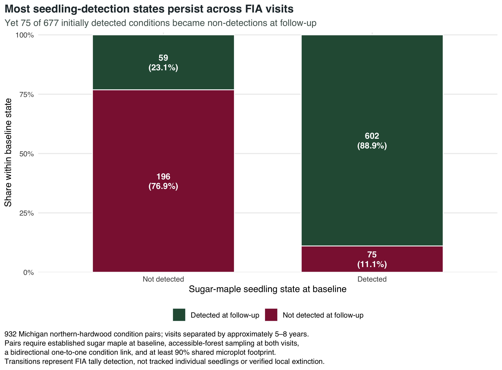

```{r}
#| label: setup
source(here::here("R", "utils.R"))

evaluation <- readr::read_csv(
  here::here("outputs", "audits", "selected-evaluation.csv"),
  show_col_types = FALSE
)
provenance <- readr::read_csv(
  here::here("outputs", "audits", "data-provenance.csv"),
  show_col_types = FALSE
)
flow <- readr::read_csv(
  here::here("outputs", "tables", "longitudinal-cohort-flow.csv"),
  show_col_types = FALSE
)
transitions <- readr::read_csv(
  here::here("outputs", "tables", "longitudinal-transition-summary.csv"),
  show_col_types = FALSE
)
support <- readr::read_csv(
  here::here("outputs", "tables", "longitudinal-loss-model-support.csv"),
  show_col_types = FALSE
)
odds <- readr::read_csv(
  here::here("outputs", "tables", "longitudinal-loss-odds-ratios.csv"),
  show_col_types = FALSE
)
comparison <- readr::read_csv(
  here::here("outputs", "tables", "longitudinal-loss-model-comparison.csv"),
  show_col_types = FALSE
)
validation <- readr::read_csv(
  here::here("outputs", "tables", "longitudinal-loss-cross-validation-summary.csv"),
  show_col_types = FALSE
)
risk <- readr::read_csv(
  here::here("outputs", "tables", "longitudinal-loss-risk-strata.csv"),
  show_col_types = FALSE
)
appearance_support <- readr::read_csv(
  here::here("outputs", "tables", "longitudinal-appearance-model-support.csv"),
  show_col_types = FALSE
)
appearance_odds <- readr::read_csv(
  here::here("outputs", "tables", "longitudinal-appearance-odds-ratios.csv"),
  show_col_types = FALSE
)
appearance_validation <- readr::read_csv(
  here::here("outputs", "tables", "longitudinal-appearance-cross-validation-summary.csv"),
  show_col_types = FALSE
)
appearance_risk <- readr::read_csv(
  here::here("outputs", "tables", "longitudinal-appearance-risk-strata.csv"),
  show_col_types = FALSE
)
random_sensitivity <- readr::read_csv(
  here::here("outputs", "tables", "longitudinal-loss-random-effect-sensitivity.csv"),
  show_col_types = FALSE
)
forest_sensitivity <- readr::read_csv(
  here::here("outputs", "tables", "longitudinal-followup-forest-type-sensitivity.csv"),
  show_col_types = FALSE
)
mapping_audit <- readr::read_csv(
  here::here("outputs", "audits", "longitudinal-mapping-audit.csv"),
  show_col_types = FALSE
)
extraction <- readr::read_csv(
  here::here("outputs", "audits", "longitudinal-extraction-summary.csv"),
  show_col_types = FALSE
)
ba_check <- readr::read_csv(
  here::here("outputs", "audits", "basal-area-validation.csv"),
  show_col_types = FALSE
)

transition_n <- function(name) {
  value <- transitions$conditions[transitions$seedling_transition == name]
  if (length(value) != 1L) stop("Missing transition: ", name)
  value
}
transition_fraction <- function(name) {
  value <- transitions$fraction_within_baseline_state[transitions$seedling_transition == name]
  if (length(value) != 1L) stop("Missing transition fraction: ", name)
  value
}
effect_row <- function(label) {
  value <- odds |> dplyr::filter(.data$label == .env$label) |> dplyr::slice_head(n = 1)
  if (nrow(value) != 1L) stop("Missing longitudinal effect: ", label)
  value
}
cv_row <- function(model = "Beech hypothesis") {
  value <- validation |> dplyr::filter(.data$model == .env$model) |> dplyr::slice_head(n = 1)
  if (nrow(value) != 1L) stop("Missing validation model: ", model)
  value
}
audit_value <- function(metric) {
  value <- extraction$value[extraction$metric == metric]
  if (length(value) != 1L) stop("Missing extraction metric: ", metric)
  value
}

loss_n <- transition_n("Loss")
persistence_n <- transition_n("Persistence")
appearance_n <- transition_n("Appearance")
non_detection_n <- transition_n("Persistent non-detection")
loss_fraction <- transition_fraction("Loss")
appearance_fraction <- transition_fraction("Appearance")
primary_cv <- cv_row()
simple_cv <- cv_row("Starting abundance and observation")
direction_models <- readr::read_csv(here::here("outputs", "audits", "research-direction-model-summary.csv"), show_col_types = FALSE)
direction_bootstrap <- readr::read_csv(here::here("outputs", "audits", "research-direction-conditional-bootstrap.csv"), show_col_types = FALSE)
added_value <- direction_bootstrap |>
  dplyr::filter(.data$model == "Beech hypothesis", .data$reference == "Starting abundance and observation")
seedling_effect <- effect_row("Baseline sugar-maple seedling density")
beech_effect <- effect_row("American beech sapling basal area")
sapling_effect <- effect_row("Sugar-maple saplings present at baseline")
maple_effect <- effect_row("Established sugar-maple basal area")
coverage_effect <- effect_row("Baseline microplot condition coverage")
highest_risk <- risk |> dplyr::filter(.data$risk_quartile == "Quartile 4") |> dplyr::slice_head(n = 1)
lowest_risk <- risk |> dplyr::filter(.data$risk_quartile == "Quartile 1") |> dplyr::slice_head(n = 1)
beech_comparison <- comparison |> dplyr::filter(.data$model == "Beech hypothesis") |> dplyr::slice_head(n = 1)
appearance_cv <- appearance_validation |>
  dplyr::filter(.data$model == "Maple stage and observation") |>
  dplyr::slice_head(n = 1)
appearance_sapling_effect <- appearance_odds |>
  dplyr::filter(.data$label == "Sugar-maple saplings present at baseline") |>
  dplyr::slice_head(n = 1)
appearance_q3 <- appearance_risk |>
  dplyr::filter(.data$risk_quartile == "Quartile 3") |>
  dplyr::slice_head(n = 1)
appearance_q4 <- appearance_risk |>
  dplyr::filter(.data$risk_quartile == "Quartile 4") |>
  dplyr::slice_head(n = 1)
```

:::: {.report-opening .column-page}
::: {.report-opening-copy}
[Michigan · repeated FIA conditions · approximately 5–8 years apart]{.report-eyebrow}

[Which detections disappear—and can new detections be anticipated?]{.report-deck}

This exploratory pilot follows mapped forest conditions through time. It describes repeated seedling tallies, not recruitment success. The [recruitment study](recruitment.qmd) now implements the revised primary direction with a new endpoint, linked-stem fates, and newly fitted models. This page preserves the supporting detection pilot.

::: {.report-tags}
[exploratory pilot]{.report-tag} [microplot continuity]{.report-tag} [strong benchmarks]{.report-tag} [county-held-out validation]{.report-tag}
:::
:::

::: {.report-cover-figure}
{fig-alt="Two stacked bars show follow-up seedling detection for baseline non-detected and detected conditions. Most states persist; 75 of 677 baseline detections become non-detections."}

[The outcome is a repeated tally state, not a claim that individual seedlings were tracked.]{.report-cover-caption}
:::
::::

::::: {.report-stats .column-page}
:::: {.report-stat}
[**`r scales::comma(audit_value("Analytical condition pairs"))`**]{.report-stat-value}

strict repeated-condition pairs
::::

:::: {.report-stat}
[**`r scales::comma(loss_n)` / `r scales::comma(loss_n + persistence_n)`**]{.report-stat-value}

baseline detections lost at follow-up
::::

:::: {.report-stat}
[**`r sprintf("%.3f", primary_cv$roc_auc)`**]{.report-stat-value}

county-held-out ROC AUC
::::

:::: {.report-stat .report-stat-accent}
[**+`r sprintf("%.3f", primary_cv$roc_auc - simple_cv$roc_auc)`**]{.report-stat-value}

AUC added over abundance and observation
::::
:::::

::: {.headline-result .column-page}
[Bottom line]{.headline-result-label}

**`r scales::percent(loss_fraction, accuracy = 0.1)` of conditions with sugar-maple seedlings detected at baseline had no seedlings tallied at the next visit.** Starting abundance, sampling coverage, and interval already account for 94.2% of the full model's Brier improvement over prevalence. Added stand variables provide a small, uncertain improvement. The earlier field-triage claim is withdrawn: these results concern detection, not regeneration failure, and do not establish operational value. Beech remains an exploratory association, not the project's organizing explanation.
:::

## Abstract {.unnumbered}

This exploratory study links `r scales::comma(audit_value("Analytical condition pairs"))` repeated Michigan Forest Inventory and Analysis (FIA) forest conditions with established sugar maple at baseline, accessible sampling at both visits, one-to-one mapping, and comparable microplot footprints. Visits were separated by `r sprintf("%.1f", audit_value("Minimum interval years"))`–`r sprintf("%.1f", audit_value("Maximum interval years"))` years. Of `r scales::comma(loss_n + persistence_n)` baseline seedling detections, `r scales::comma(loss_n)` became non-detections. County-held-out validation of a seven-slope logistic model gave Brier `r sprintf("%.5f", primary_cv$brier_score)` and AUC `r sprintf("%.3f", primary_cv$roc_auc)`, compared with `r sprintf("%.5f", simple_cv$brier_score)` and `r sprintf("%.3f", simple_cv$roc_auc)` for starting abundance, coverage, and interval alone. The added predictive improvement is small and uncertain under a paired county bootstrap conditional on existing fitted folds. Sixty of 75 losses began with no more than five tallied seedlings. Among `r appearance_support$baseline_nondetected_cohort_n` baseline non-detections, `r appearance_support$appearances` became detections; a four-slope appearance model had weak held-out discrimination (AUC `r sprintf("%.3f", appearance_cv$roc_auc)`). Neither endpoint measures individual survival or sapling recruitment. The pilot is retained as measurement evidence; the revised primary goal evaluates recruitment and linked sapling fates rather than promoting a detection-risk tool.

## Why the research direction changed

The first project release asked which size classes occurred together at one visit. That work produced an important measurement result: combining 1–4.9-inch saplings with trees at least 5 inches DBH made “maple abundance” look more informative than established-tree abundance alone. Once FIA size classes were separated, sapling presence—not additional established-maple basal area—carried most of the same-visit association.

Repeated conditions improved time ordering, but the detection pilot still leaves the central ecological question unanswered: do observed seedlings lead to advancing regeneration? Presence can persist without advancement, while disappearance from a size class can include growth into a larger class. The current direction review therefore changes the primary endpoint, not merely the model's complexity.

Michigan studies report abundant small seedlings alongside limited larger regeneration [@henry2021], and show that small-diameter sugar maples can be old, suppressed stems [@henry2023]. Regional FIA studies distinguish favorable small-seedling composition from low sugar-maple sapling abundance [@harris2026]. Browse relationships vary by size class [@harris2025]. The Canadian beech association is a candidate hypothesis, with geography, size-class definitions, and relative-abundance measures limiting transfer [@gauthier2025].

Crucially, prior research already predicts FIA sapling recruitment and compares ordinary seedling counts with six height classes [@harris2022]; advance-regeneration prediction after disturbance is also established [@harris2026disturbance]. A useful contribution here must be a Michigan evaluation of indicator performance and limitations, not a claim that longitudinal FIA forecasting is novel.

## Questions addressed by this pilot

The pilot's primary question was:

> Among Michigan northern-hardwood conditions with established sugar maple and seedlings detected at baseline, which baseline characteristics predict no seedling detection at the next FIA measurement?

Four secondary questions keep the interpretation honest:

1. How often do the four detection transitions—persistent non-detection, appearance, loss, and persistence—occur?
2. Does American beech sapling basal area add information beyond starting seedling density and general stand structure?
3. Does the risk signal survive when whole counties are withheld during model fitting?
4. Among baseline non-detections, can a lean model forecast later detection appearance?

The estimand is a repeated observation probability. It is not individual seedling survival, recruitment into the sapling class, or a causal effect of competition or management.

## Data and cohort

### FIA source and analytical grain

The analysis uses the Michigan SQLite release from the U.S. Forest Service FIA DataMart [@usfs_datamart] and pins current evaluation “`r evaluation$eval_descr`” (EVALID `r format(evaluation$evalid, scientific = FALSE)`; inventory window `r evaluation$start_invyr`–`r evaluation$end_invyr`). Sugar maple resolves from `REF_SPECIES` to *Acer saccharum* (SPCD 318), American beech to *Fagus grandifolia* (SPCD 531), and the baseline northern-hardwood cohort to active forest-type group 800 codes [@burrill2025fiadb].

The unit is one linked pair of FIA plot conditions. Control numbers are relational identifiers, not coordinates. Exact FIA plot locations are neither used nor inferred; county identifiers are retained only for grouped validation.

### Following the same microplot footprint

`SUBP_COND_CHNG_MTRX` supplies the authoritative condition linkage. Because seedlings are sampled on microplots, the extraction uses `SUBPTYP = 2`. Rows are first aggregated to each baseline–follow-up condition pair:

$$
Overlap_{bc} = \frac{1}{4}\sum_{s=1}^{4} SUBPTYP\_PROP\_CHNG_{bcs}.
$$

Pair degrees are computed before ecological filters. The primary cohort retains only bidirectional one-to-one links, then requires the overlap divided by both baseline and follow-up `MICRPROP_UNADJ` to be at least 0.90. Small conditions are therefore not rejected merely because their absolute area share is below 0.90. Among strict links, the minimum observed relative overlap was `r sprintf("%.3f", mapping_audit$value[mapping_audit$metric == "Minimum baseline overlap fraction among strict pairs"])`.

Baseline eligibility requires a sampled accessible-forest condition in forest-type group 800, positive microplot coverage, and at least one live sugar-maple TREE record with DBH ≥5 inches. Follow-up must be sampled accessible forest with positive microplot coverage. It is not required to remain in group 800 because follow-up classification is post-baseline; `r scales::percent(forest_sensitivity$fraction[forest_sensitivity$cohort != "Primary strict-pair cohort"], accuracy = 0.1)` nevertheless remained in that group.

```{r}
#| label: tbl-longitudinal-flow
#| tbl-cap: "Longitudinal cohort flow. Pair degrees are evaluated before ecological filtering; the primary model uses the final strict repeated-condition cohort."
flow_table <- flow |>
  dplyr::transmute(
    Step = .data$step,
    `Pair rows` = scales::comma(.data$pair_rows),
    `Baseline conditions` = scales::comma(.data$baseline_conditions),
    `Physical plots` = scales::comma(.data$physical_plots)
  )
knitr::kable(flow_table, align = c("l", "r", "r", "r"))
```

## Methods

### Repeated outcome

A sampled condition is detected when its aggregated sugar-maple `SEEDLING` density is positive. A missing sugar-maple row becomes zero only when `MICRPROP_UNADJ > 0` demonstrates sampling opportunity. The four transitions are defined independently from baseline and follow-up tallies. The primary binary outcome equals one for baseline detected → follow-up not detected and zero for detected → detected.

“Loss” is shorthand for loss of detection. FIA does not tag individual seedlings, and a zero tally does not demonstrate ecological absence across the forest condition.

### Baseline predictors

All ecological predictors are measured at baseline; interval length is an exposure-time design covariate:

- baseline sugar-maple seedling density, representing starting abundance;
- baseline sugar-maple sapling presence (DBH 1–4.9 inches);
- established sugar-maple basal area (DBH ≥5 inches);
- American beech sapling basal area (DBH 1–4.9 inches);
- non-maple basal area excluding beech saplings, while retaining established beech as background stand structure;
- baseline microplot condition coverage, representing detection opportunity; and
- elapsed years between measurements.

Each basal-area contribution uses the FIA frame on which the tree was sampled. Microplot trees divide by `MICRPROP_UNADJ`, subplot trees by `SUBPPROP_UNADJ`, and applicable macroplot trees by `MACRPROP_UNADJ`. In the current-evaluation cross-sectional audit, the same implementation reproduces FIA `COND.BALIVE` with mean absolute error `r sprintf("%.6f", ba_check$mean_absolute_error_ft2_ac)` ft²/acre across `r scales::comma(ba_check$observations)` conditions.

### Model and validation

The primary prognostic model is:

$$
\begin{aligned}
\operatorname{logit}\{P(Loss_c=1)\} =\;& \beta_0
+ \beta_1z\{\log(1 + SeedlingTPA_c)\}
+ \beta_2 SaplingPresent_c \\
&+ \beta_3z\{\log(1 + BA^{est}_{maple,c})\}
+ \beta_4z\{\log(1 + BA^{sap}_{beech,c})\} \\
&+ \beta_5z\{\log(1 + BA_{other,c})\}
+ \beta_6z(Coverage_c)
+ \beta_7z(Interval_c).
\end{aligned}
$$

Continuous predictors are standardized within the complete model cohort; every validation fold relearns transformations using training counties only. The `r support$losses` losses provide `r sprintf("%.1f", support$losses_per_slope)` events per slope. This accounting ratio does not guarantee adequate sample size or stable prediction; outcome frequency, clustering, complexity, and expected performance also matter [@riley2020]. County-cluster CR1 intervals address within-county dependence. A county random-intercept model is retained as sensitivity evidence.

Five deterministic folds hold out entire counties. Reported internal-validation measures are pooled Brier score, ROC AUC, calibration intercept and slope, and Brier skill relative to an intercept-only prevalence benchmark. No county effect or scaling information is transferred to a held-out county.

Nested models separate what each layer contributes: a prevalence benchmark; starting seedling density, coverage, and interval; additional maple stage and stand structure; and finally the American beech sapling hypothesis.

The secondary appearance model is conditioned on no baseline seedling detection. Its four slopes are sugar-maple sapling presence, standardized `log1p` established-maple basal area, standardized baseline microplot coverage, and standardized interval length. This lean specification represents maple stage continuity, observation opportunity, and exposure time without importing the beech loss hypothesis. The `r appearance_support$appearances` appearances provide `r sprintf("%.2f", appearance_support$appearances_per_slope)` events per slope overall; the leanest validation training set retains `r appearance_support$minimum_training_appearances` appearances, or `r sprintf("%.1f", appearance_support$minimum_training_appearances_per_slope)` per slope. It uses the same county-held-out and training-only-scaling protocol as the loss model.

## Results

### Four transition states

```{r}
#| label: fig-longitudinal-transitions
#| column: page
#| fig-cap: "Sugar-maple seedling detection across repeated FIA conditions. Percentages are conditional on the baseline state."
#| fig-alt: "Two stacked bars show 23.1 percent appearance among baseline non-detections and 11.1 percent loss among baseline detections."
knitr::include_graphics(here::here("outputs", "figures", "08_longitudinal_transitions.png"))
```

Among `r scales::comma(loss_n + persistence_n)` baseline detections, `r scales::comma(loss_n)` became non-detections and `r scales::comma(persistence_n)` persisted. Among `r scales::comma(appearance_n + non_detection_n)` baseline non-detections, `r scales::comma(appearance_n)` (`r scales::percent(appearance_fraction, accuracy = 0.1)`) became detections. These asymmetric denominators are why loss and appearance are described separately rather than forced into a parameter-heavy multinomial model.

```{r}
#| label: tbl-transitions
#| tbl-cap: "Observed transition counts and fractions within each baseline state."
transition_table <- transitions |>
  dplyr::transmute(
    Transition = .data$seedling_transition,
    `Baseline state` = .data$baseline_state,
    Conditions = scales::comma(.data$conditions),
    `Fraction within baseline state` = scales::percent(
      .data$fraction_within_baseline_state,
      accuracy = 0.1
    )
  )
knitr::kable(transition_table, align = c("l", "l", "r", "r"))
```

### Detection-loss associations

```{r}
#| label: fig-longitudinal-warning
#| column: page
#| fig-cap: "Baseline early-warning associations and geographically held-out risk strata. Odds-ratio intervals use county-cluster CR1 uncertainty; risk-quartile predictions come only from models that excluded the condition's county."
#| fig-alt: "A forest plot shows lower loss odds with greater initial seedling density and sampling coverage, and higher odds with American beech sapling basal area. A bar chart shows loss rising from 0.6 percent in the lowest predicted-risk quartile to 32.5 percent in the highest."
knitr::include_graphics(here::here("outputs", "figures", "09_longitudinal_early_warning.png"))
```

The clearest detection-risk warning was a thin starting cohort. A one-SD increase in transformed baseline seedling density corresponded to OR `r sprintf("%.2f", seedling_effect$odds_ratio)` (95% CI `r sprintf("%.2f–%.2f", seedling_effect$conf_low, seedling_effect$conf_high)`) for later non-detection. Because the model conditions on a positive baseline tally, this strong association can include regression to the mean and repeated-count variability as well as biological change. Coverage also mattered (OR `r sprintf("%.2f", coverage_effect$odds_ratio)`, 95% CI `r sprintf("%.2f–%.2f", coverage_effect$conf_low, coverage_effect$conf_high)`), consistent with observation opportunity contributing to apparent risk; the association may also reflect ecological differences among condition footprints.

American beech sapling basal area had OR `r sprintf("%.2f", beech_effect$odds_ratio)` (95% CI `r sprintf("%.2f–%.2f", beech_effect$conf_low, beech_effect$conf_high)`). Adding it to the stage-structure model reduced AIC by `r sprintf("%.2f", comparison$aic[comparison$model == "Stage structure"] - beech_comparison$aic)` and improved the nested likelihood-ratio comparison (*p* = `r sprintf("%.3f", beech_comparison$likelihood_ratio_p_value)`). In county-held-out validation it modestly improved both Brier score and AUC relative to the stage-structure model. This consistency makes beech a credible follow-up hypothesis, but not a demonstrated mechanism.

Sugar-maple sapling presence was associated with directionally lower loss odds (OR `r sprintf("%.2f", sapling_effect$odds_ratio)`, 95% CI `r sprintf("%.2f–%.2f", sapling_effect$conf_low, sapling_effect$conf_high)`) but imprecisely. Established-maple basal area also had an imprecise association (OR `r sprintf("%.2f", maple_effect$odds_ratio)`, 95% CI `r sprintf("%.2f–%.2f", maple_effect$conf_low, maple_effect$conf_high)`). These intervals do not establish protective effects or their absence.

```{r}
#| label: tbl-longitudinal-effects
#| tbl-cap: "Primary longitudinal model associations. Continuous effects are per one SD on the transformed scale; intervals use county-cluster CR1 covariance."
effect_table <- odds |>
  dplyr::transmute(
    Predictor = .data$label,
    `Odds ratio` = sprintf("%.2f", .data$odds_ratio),
    `95% CI` = sprintf("%.2f–%.2f", .data$conf_low, .data$conf_high),
    `Robust p-value` = dplyr::if_else(
      .data$robust_p_value < 0.001,
      "<0.001",
      sprintf("%.3f", .data$robust_p_value)
    )
  )
knitr::kable(effect_table, align = c("l", "r", "r", "r"))
```

### Geographic validation and risk separation

The full model achieved held-out Brier score `r sprintf("%.3f", primary_cv$brier_score)`, AUC `r sprintf("%.3f", primary_cv$roc_auc)`, calibration intercept `r sprintf("%.3f", primary_cv$calibration_intercept)`, and calibration slope `r sprintf("%.3f", primary_cv$calibration_slope)`. Its Brier skill relative to fold-specific prevalence was `r scales::percent(primary_cv$brier_skill_vs_prevalence, accuracy = 0.1)`.

The highest predicted-risk quartile contained `r highest_risk$losses` of all `r support$losses` losses and had an observed loss fraction of `r scales::percent(highest_risk$observed_loss_fraction, accuracy = 0.1)`. The lowest quartile had `r lowest_risk$losses` loss (`r scales::percent(lowest_risk$observed_loss_fraction, accuracy = 0.1)`). Predicted and observed fractions were close in all four quartiles, but these are internal risk strata—not universal intervention thresholds.

```{r}
#| label: tbl-longitudinal-validation
#| tbl-cap: "Five-fold validation with whole counties held out. The prevalence benchmark has no meaningful discrimination or calibration slope."
validation_table <- validation |>
  dplyr::transmute(
    Model = .data$model,
    Brier = sprintf("%.3f", .data$brier_score),
    AUC = dplyr::if_else(is.na(.data$roc_auc), "—", sprintf("%.3f", .data$roc_auc)),
    `Calibration slope` = dplyr::if_else(
      is.na(.data$calibration_slope),
      "—",
      sprintf("%.3f", .data$calibration_slope)
    ),
    `Brier skill` = scales::percent(.data$brier_skill_vs_prevalence, accuracy = 0.1)
  )
knitr::kable(validation_table, align = c("l", "r", "r", "r", "r"))
```

The county random-intercept sensitivity converged without singularity and estimated county variance `r sprintf("%.3f", random_sensitivity$county_variance[random_sensitivity$model == "County random-intercept sensitivity"])`. Its AIC was slightly higher than the fixed-effect model. The small difference does not decisively resolve the grouping specification.

### Reassessment: what does the full model add?

A high AUC is not sufficient evidence of useful ecological prediction. The abundance-and-observation benchmark already achieves AUC `r sprintf("%.3f", simple_cv$roc_auc)`. Relative to that benchmark, the full model's Brier difference is `r sprintf("%.5f", added_value$brier_difference)` (95% conditional county-bootstrap interval `r sprintf("%.5f to %.5f", added_value$brier_difference_lower, added_value$brier_difference_upper)`; negative favors the full model). The AUC difference is `r sprintf("%.3f", added_value$auc_difference)` (interval `r sprintf("%.3f to %.3f", added_value$auc_difference_lower, added_value$auc_difference_upper)`). These intervals resample counties in existing held-out predictions without refitting; they omit model-development and fold-selection uncertainty. They do not prove equivalence or rule out useful improvement.

```{r}
#| label: tbl-direction-benchmarks
#| tbl-cap: "Exploratory benchmark audit on identical held-out observations. Top 169 is a matched comparison capacity, not a management threshold."
direction_table <- direction_models |>
  dplyr::filter(.data$model %in% c("Starting density only", "Starting abundance and observation", "Beech hypothesis", "Maple structure and total nonmaple", "Maple structure and total nonmaple plus beech")) |>
  dplyr::transmute(Model = .data$model, Brier = sprintf("%.5f", .data$brier_score),
    AUC = sprintf("%.3f", .data$roc_auc), `Losses among top 169` = .data$top_quartile_losses)
knitr::kable(direction_table, align = c("l", "r", "r", "r"))
```

At identical capacity, the full model captures 55 losses versus 53 for the strong benchmark. A fair comparator using total non-maple basal area, then adding beech, gives almost the same full-model performance; fixing that comparison does not erase the beech association. Its incremental uncertainty still warrants caution.

Direct source-count reconciliation found 34 losses among 82 conditions starting with one tallied seedling, 26 among 129 starting with two to five, 12 among 183 with six to twenty, and three among 283 with more than twenty. Thus 60 of 75 losses began with five or fewer tallied seedlings. This pattern persists on nearly fully covered conditions. It supports studying sparse-count instability, without establishing how much is biological versus observational.

### Appearance occurred, but was not forecast reliably

Among the `r scales::comma(appearance_support$baseline_nondetected_cohort_n)` conditions without a baseline detection, `r scales::comma(appearance_support$appearances)` (`r scales::percent(appearance_support$appearance_fraction, accuracy = 0.1)`) had a positive tally at follow-up. This is detection appearance, not proof of new recruitment or establishment.

The full secondary model achieved held-out Brier score `r sprintf("%.3f", appearance_cv$brier_score)` against `r sprintf("%.3f", appearance_validation$brier_score[appearance_validation$model == "Prevalence benchmark"])` for the fold-specific prevalence benchmark, AUC `r sprintf("%.3f", appearance_cv$roc_auc)`, and calibration slope `r sprintf("%.3f", appearance_cv$calibration_slope)`. Its Brier skill was only `r scales::percent(appearance_cv$brier_skill_vs_prevalence, accuracy = 0.1)`. Risk ranking was not monotonic: observed appearance was `r scales::percent(appearance_q3$observed_appearance_fraction, accuracy = 0.1)` in quartile 3 and `r scales::percent(appearance_q4$observed_appearance_fraction, accuracy = 0.1)` in quartile 4.

Sugar-maple sapling presence had OR `r sprintf("%.2f", appearance_sapling_effect$odds_ratio)` (95% county-cluster interval `r sprintf("%.2f–%.2f", appearance_sapling_effect$conf_low, appearance_sapling_effect$conf_high)`), but its interval crossed one. No appearance-model interval excluded one. The tested specification performed weakly in this cohort and partition. That does not establish a predictive limit of all FIA variables or methods, or imply that appearance is ecologically unstructured.

```{r}
#| label: tbl-appearance-effects
#| tbl-cap: "Secondary appearance-model associations among baseline non-detections. Continuous effects are per one SD on the transformed scale; all county-cluster intervals include one."
appearance_effect_table <- appearance_odds |>
  dplyr::transmute(
    Predictor = .data$label,
    `Odds ratio` = sprintf("%.2f", .data$odds_ratio),
    `95% CI` = sprintf("%.2f–%.2f", .data$conf_low, .data$conf_high),
    `Robust p-value` = sprintf("%.3f", .data$robust_p_value)
  )
knitr::kable(appearance_effect_table, align = c("l", "r", "r", "r"))
```

## Discussion

:::: {.interpretation-grid .column-page}
::: {.interpretation-card .interpretation-supported}
[What the evidence supports]{.interpretation-kicker}

- Seedling detection is usually persistent, but roughly one in nine baseline detections became a zero tally at the next visit.
- Low starting seedling tallies are strongly associated with later zero tallies.
- Detection opportunity must remain explicit when interpreting these transitions.
- The stand variables add little prediction beyond abundance and observation; beech remains an exploratory association.
- County-held-out detection ranking is not evidence of recruitment prediction or management value.
- Detection appearance occurred in nearly one quarter of baseline non-detections, but the tested compact model did not forecast it reliably.
:::

::: {.interpretation-card .interpretation-boundary}
[What it does not establish]{.interpretation-kicker}

- That the original seedlings died or that sugar maple became locally extinct.
- That American beech caused the change rather than marking browsing, soils, disturbance history, or other site conditions.
- Which management treatment would prevent loss.
- Statewide or county prevalence under the formal FIA survey design.
- Performance in another state, inventory cycle, or independent field study.
- That the appearance model can identify sites likely to gain seedlings.
:::
::::

The earlier recommendation to use this model for field triage was premature. A triage study would need a regeneration-relevant outcome, a stated survey objective and capacity, and evidence of improvement over a simple abundance rule. The present pilot supplies none of those operational validations. Its useful contribution is to expose the distinction between repeat detection and advancing regeneration.

The beech signal could reflect competitive pressure, deer selectivity, site fertility, sprouting history, or unmeasured management. It is one hypothesis among several, not a prescription or sufficient reason to organize the next study around beech.

## Limitations

1. **Detection, not tracked survival.** FIA seedlings are tally records, not tagged individuals. A transition to zero can reflect mortality, growth out of the size class, spatial turnover, phenology, or imperfect detection.
2. **Conditioning and repeated counts.** The loss model begins with positive baseline tallies and uses their density as its strongest predictor. Low positive counts are mechanically more likely to become zero under repeated sampling, so this coefficient can reflect regression to the mean or count variability even when latent abundance is stable.
3. **Observation footprint.** Although all primary pairs share at least 90% of both condition footprints—and in practice at least 99.1%—smaller microplot condition shares still provide fewer opportunities to encounter seedlings.
4. **Strict-pair selection.** Split, merged, inaccessible, and nonforest follow-ups are excluded from the primary biological outcome. Nine otherwise eligible strict baseline conditions lacked a comparable follow-up.
5. **Two observations.** One interval identifies a transition but not a trajectory, lag structure, or recruitment rate.
6. **Prognostic coefficients.** Baseline associations do not identify causal effects. Inter-visit treatment was deliberately excluded from the primary model because timing and confounding by indication are inadequate for causal inference.
7. **Unmeasured mechanisms.** Browse, detailed seedling height, soils, invasive plants, and understory vegetation are available only for small nested FIA subsets.
8. **Internal validation.** County-held-out validation tests geographic transport within Michigan, not external generalization. The reassessment reuses these folds; its bootstrap is conditional on fitted predictions. This is exploratory reanalysis, not untouched confirmation.
9. **Weak gain model.** The secondary appearance model has low discrimination and shrinkage-prone calibration. Appearance may depend on unmeasured seed production, microsites, browse, disturbance timing, or count variation; it is not a usable site-level gain forecast.
10. **Survey estimand.** `TPA_UNADJ` and condition proportions support within-plot density construction; they are not statewide survey weights. Formal prevalence requires FIA population-estimation procedures [@bechtold2005sampling].

## Reproducibility

The pipeline records `r nrow(provenance)` hashed source artifacts, a pinned evaluation, condition-link audits, frame-specific basal-area validation, cohort flow, scaling constants, model support, county-cluster inference, nested model comparisons, fold assignments, held-out predictions for both conditional outcomes, and tests. The mapping audit found zero broken condition references and zero disagreements between matrix predecessor links and `PLOT.PREV_PLT_CN`.

From a fresh clone:

```bash
make setup
make acquire
make all
```

The `longitudinal` target runs `scripts/09_build_longitudinal_dataset.R` and `scripts/10_longitudinal_models.R`. The `direction-audit` target runs the benchmark and recruitment-feasibility audits in scripts 11 and 12. Raw, interim, and record-level processed FIA data remain excluded from version control; aggregate evidence and figures contain no plot coordinates.

## Next research step

The [recruitment study](recruitment.qmd) now tests whether ordinary seedling and sapling observations anticipate new sapling recruitment. Its audited cohort contains 922 intervals, 169 new live saplings in 100 conditions, and a companion linked-stem fate analysis. The original 171-stem feasibility screen and 2,308 historical candidate intervals are retained in the direction audit; they are not the final recruitment model population. See the [current goals](../docs/research-direction.md) for what is implemented and what remains unresolved.

First validate ingrowth codes, sampling-frame continuity, species corrections, and sampled zero-tree visits. Then compare a small sequence of observation, abundance, and stage-structure models using grouped validation and a retrospective temporal check. Report surviving growth, death, and identity changes separately. RI height classes are a conditional extension if repeated Michigan support proves adequate; any browse predictor needs a circularity check. Negative or imprecise incremental results are valid outcomes of this study.

## References {.unnumbered}

::: {#refs}
:::

::: {.report-footer .column-page}
**Canopy to Cohort** · Supporting detection pilot · [Primary recruitment study](recruitment.qmd)
:::
