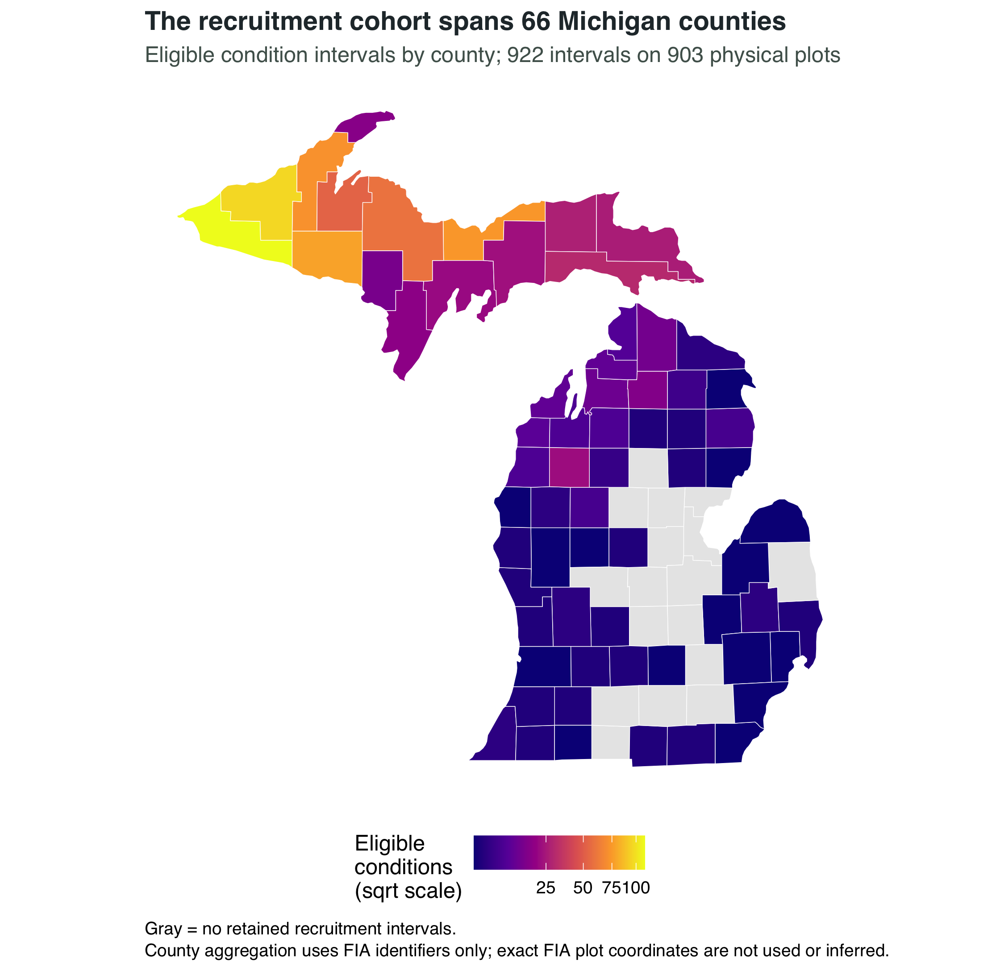
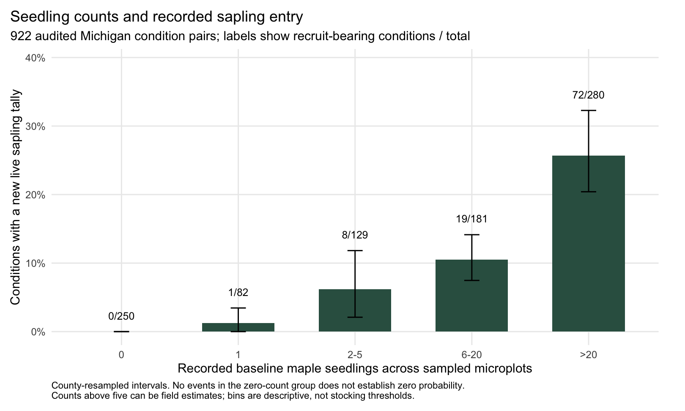
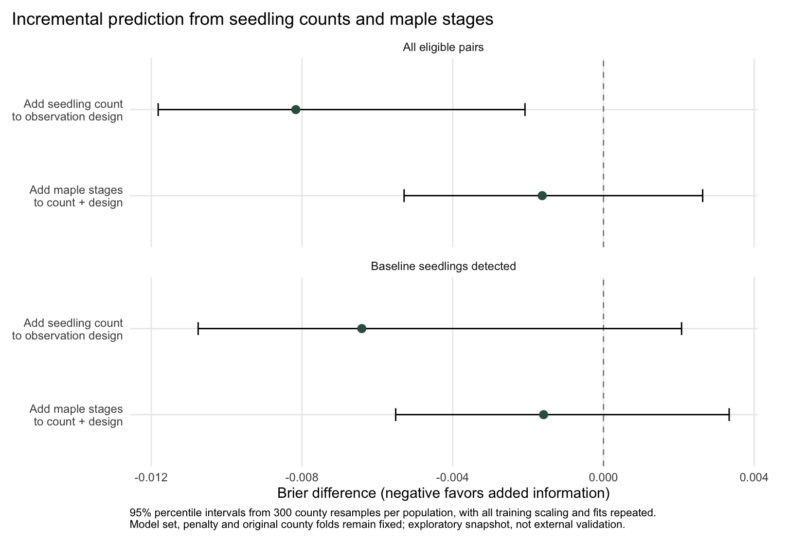
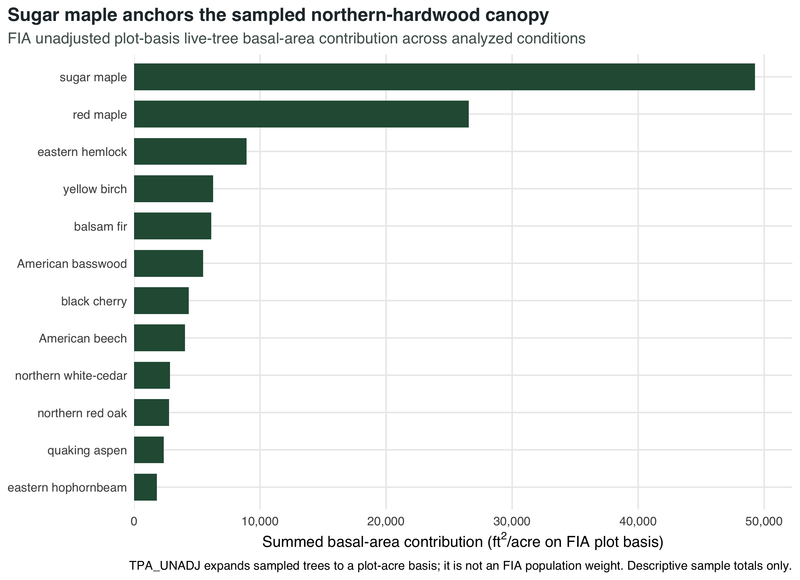
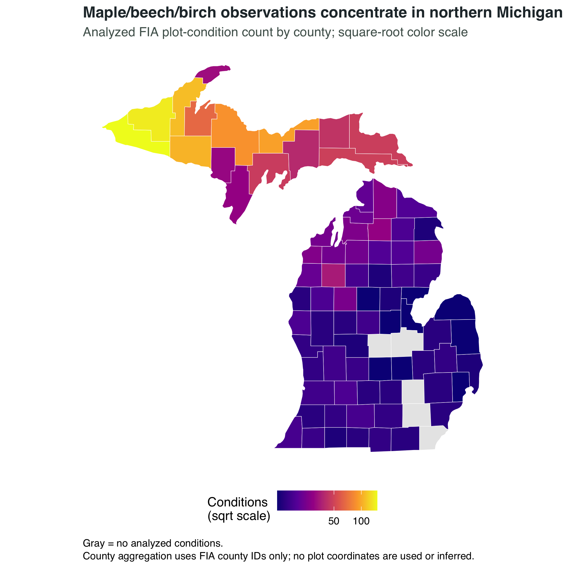
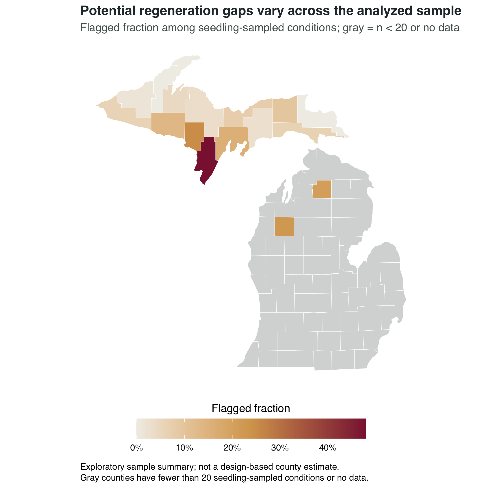
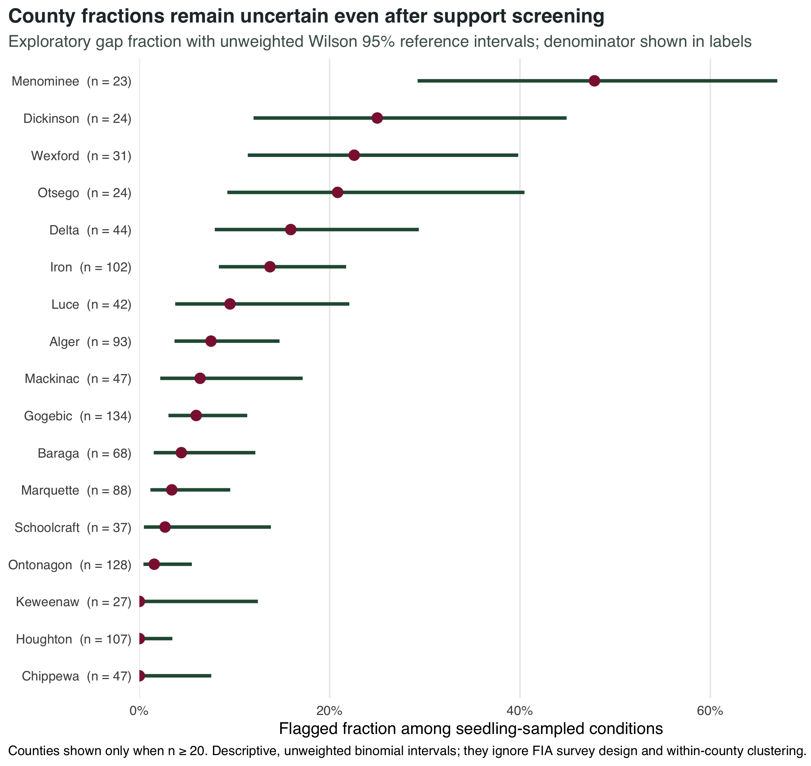
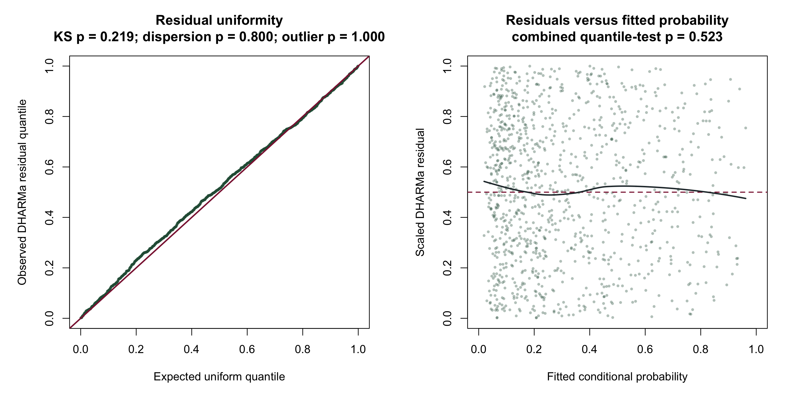

```{r}
cohort <- readr::read_csv(
  here::here("outputs", "tables", "recruitment-cohort-flow.csv"),
  show_col_types = FALSE
) |>
  dplyr::filter(.data$cohort == "Reconciled recruitment cohort")
foundation <- readr::read_csv(
  here::here("outputs", "tables", "analysis-summary.csv"),
  show_col_types = FALSE
)
stopifnot(nrow(cohort) == 1, nrow(foundation) == 1)
```

:::: {.report-opening .column-page}
::: {.report-opening-copy}
[Michigan · county-safe FIA geography · exploratory visuals]{.report-eyebrow}

[Maps explain where the evidence comes from; they do not turn a sample into a statewide estimate.]{.report-deck}

This page brings the project's visual evidence together. The current recruitment
study is shown first. The earlier maps and charts remain because they explain the
sample, separate FIA size classes, and show how the research question changed.
They are labeled as foundation or pilot evidence where they are not part of the
recruitment endpoint.
:::

::: {.report-cover-figure}
{fig-alt="Map of Michigan counties shaded by the number of eligible recruitment condition intervals. Northern counties contain most of the retained intervals; counties with no retained interval are gray."}

[The current recruitment cohort is mapped by county, never by exact FIA plot location.]{.report-cover-caption}
:::
::::

## Current recruitment study

The primary analysis retains `r scales::comma(cohort$conditions)` baseline to
follow-up condition intervals on `r scales::comma(cohort$physical_plots)` physical
plots across `r cohort$counties` counties. The map shows **where the retained
sample is distributed**, not the probability of recruitment in each county.
Counties with more intervals are darker because they contribute more observations;
that is sample support, not a county ranking.

```{r}
#| label: fig-current-recruitment-map
#| fig-cap: "Current recruitment cohort by county. Fill shows the number of retained condition intervals on the square-root scale. This is a sample-support map, not a design-based county estimate or an exact plot map."
#| fig-alt: "Michigan county map shaded by retained recruitment condition intervals; northern counties have most of the sample and counties with no retained intervals are gray."
#| out-width: "100%"
knitr::include_graphics(here::here("outputs", "figures", "07_recruitment_cohort_map.png"))
```

The two current result figures belong to the recruitment report: the count
gradient shows recorded entry by baseline seedling count, and the paired Brier
plot compares added information on matched observations. Their interpretation
depends on the held-out county design and the caveats in the [full recruitment
report](recruitment.qmd).

{fig-alt="Bars show recorded new sapling entry increasing from zero among 250 zero-count conditions to 25.7 percent among 280 conditions with more than 20 recorded seedlings."}

{fig-alt="County-bootstrap intervals show a clearer improvement when seedling count is added to observation design, while the additional maple-stage improvement is small and intervals cross zero."}

## Earlier foundation: composition and size classes

These figures come from the earlier cross-sectional analysis of
`r scales::comma(foundation$plot_conditions)` forest conditions in
`r foundation$counties` counties. They are useful context for understanding
which species and size classes were present before the project moved to repeated
visits. They are not estimates of the current recruitment endpoint.

### Sample composition

{fig-alt="Horizontal bars show the share of live-tree basal-area contribution for the leading species in the earlier FIA sample, with sugar maple highlighted."}

This chart describes the composition of the analyzed sample. It does not imply
that basal-area contribution is a statewide FIA estimate or that larger maple
basal area measures recent regeneration.

### Separating established trees from seedlings

{fig-alt="A two-part figure relates positive sugar-maple seedling tallies to established-tree basal-area share and counts conditions with zero seedling tallies separately."}

This screen motivated separating established trees, saplings, and seedlings.
The later recruitment study asks a different question by using the next-visit
recorded sapling entry as its endpoint.

## Earlier detection pilot and spatial summaries

The detection pilot followed whether a seedling tally was present at both visits.
That remains a supporting analysis because a missing later tally is not the same
as failed recruitment. Its repeated-transition figures are available on the
[detection pilot page](index.qmd).

### County-level pilot context

{fig-alt="Michigan county map shaded by the number of analyzed condition observations in the earlier cross-sectional foundation, with counties lacking observations in gray."}

The earlier sample-support map used a different cohort and denominator than the
current recruitment map. Keeping both visible makes that change explicit.

{fig-alt="Michigan counties shaded by the fraction of seedling-sampled conditions flagged as potential detection gaps in the earlier pilot; counties with insufficient support are gray."}

{fig-alt="County interval plot showing wide unweighted uncertainty around exploratory detection-gap fractions after a minimum support screen."}

The two county-gap figures are descriptive summaries of the earlier detection
pilot. They are not county rankings, statewide rates, or maps of biological
regeneration failure. The county identifier is the only spatial link used;
exact FIA plot locations are not available in the public data and are neither
used nor inferred here.

## Earlier model evidence

The original cross-sectional model and its diagnostics remain available for
technical review. They document the model foundation, but they should not be
read as the answer to the current recruitment question.

{fig-alt="Forest plot of adjusted effects from the earlier cross-sectional seedling-detection model, with uncertainty intervals for measured stand, observation, and climate variables."}

{fig-alt="Two-panel residual diagnostic from the earlier cross-sectional mixed-effects model, showing simulation-based residual checks against reference behavior."}

The current recruitment report uses a separate fixed benchmark sequence,
county-held-out validation, and a distinct recorded-entry endpoint. Keeping the
old model figures here preserves the analytical history without blending its
associations with the new result.

## How to read the visual record

- **Current recruitment evidence:** the county-support map, count-gradient
  figure, and paired model-comparison figure. These correspond to the 922-pair
  recruitment analysis.
- **Foundation evidence:** species composition and the earlier size-class
  screen. These helped define the ecological question.
- **Detection-pilot evidence:** repeated tally transitions, county-gap maps,
  earlier model effects, and diagnostics. These describe observation changes,
  not individual seedling survival or sapling recruitment.

The [research direction](../docs/research-direction.html) records why the project
moved from detection loss to sapling recruitment. The [full recruitment report](recruitment.qmd)
contains the primary estimates, uncertainty, methods, and limitations.

::: {.report-footer .column-page}
**Canopy to Cohort** · Spatial context and exploratory visuals · [Primary recruitment study](recruitment.qmd)
:::
